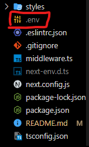

<h1 align="center">Scientific Event Project</h1>
<h2 align="center">This project was made for <a>Elielson Urbano</a></h2>

<ul>
    <h3><strong>Technologies used: </strong></h3>
    <li>NextJS</li> 
    <li>Typescript</li>
    <li>Mysql</li>
</ul>
<ul>
    <h3><strong>Concepts used: </strong></h3>
    <li>Cookies</li> 
    <li>Styled Components</li>
    <li>Middleware</li>
    <li>Routes</li>
    <li>States</li>
    <li>API</li>
</ul>
<h3>To run this project you will need to create a specific database(with mysql), an .env file and install the used libraries , see below how to do this:</h3>
 
<section>

    <h4><Strong>The line below will create the database that will be used by the project:</Strong></h4>
    

    create database if not exists scientificevent;

    <h4><strong>The line below will make the database the target of the next lines</strong></h4>
    

    use scientificevent;

    <h4><strong>The code bellow will create the users table: </strong></h3>
    

    create table if not exists users (
        IdUsers int unsigned not null auto_increment primary key,
        Username varchar(45) not null,
        Email varchar(30) not null,
        Token varchar(36) not null,
        IsAdmin boolean,
        UserPassword varchar(35) not null
    )

    <h4><strong>The code bellow will create the articles table:</strong>
    </h4>

    create table if not exists articles(
        IdArticle int unsigned not null auto_increment primary key,
        Allowed boolean,
        Content varchar(800) not null,
        Title varchar(20),
        User_ID int unsigned,
        foreign key (User_ID) references users (IdUsers)
    )

    <h4><strong>The line bellow will turn the database acessible for localhost: </strong></h4>
    

    alter user 'root'@'localhost' indetified with mysql_native_password by 'yourpassword';

</section>
<h3>Now, you need to config the .env file, follow the bellow steps:</h3>
 
<section>

    <h4><strong>Create an .env file at the root directory of the project</strong></h4>
    

    <h4><strong>Add the bellow enviroment variables in your .env file (pay attention to the values):</strong></h4>

    MYSQL_HOST="localhost"
    MYSQL_PORT=3306
    MYSQL_DATABASE="scientificevent"
    MYSQL_PASSWORD="yourpassword"
    MYSQL_USER="root"

</section>
<h3>Finally, you can run:</h3>
<section>

    npm install

    #this will install the used libraries

    npm run dev

    this will run the server on:
    <a href="http://localhost:3000">localhost:3000</a>
</section>

 
